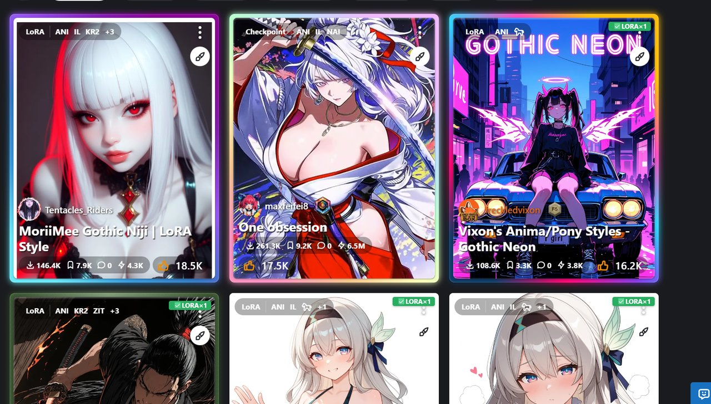
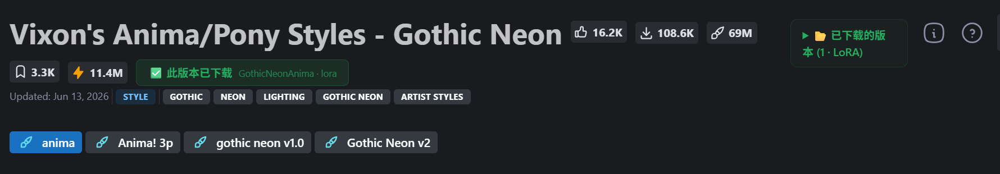
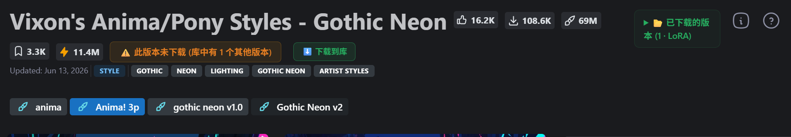
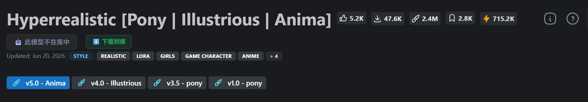
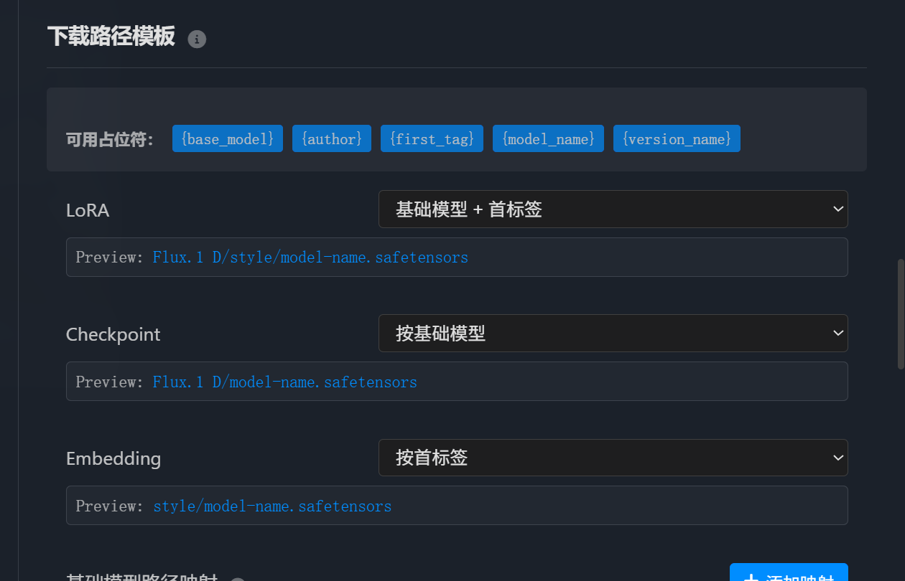
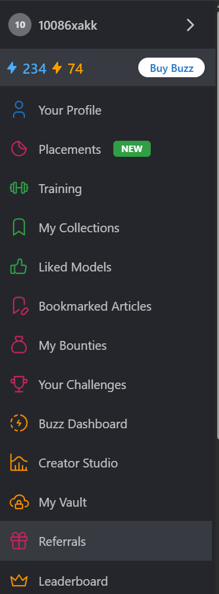
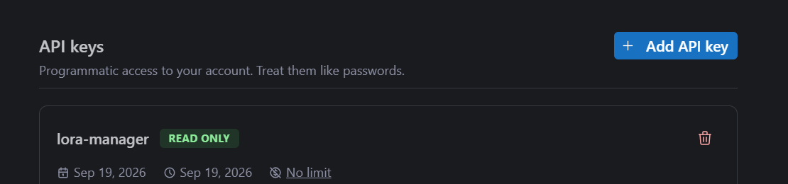

# LoRA Manager Bridge

浏览 CivitAI / CivArchive 时，自动标记哪些模型已经在你的本地 ComfyUI LoRA Manager 库中。



覆盖 civitai.com、civitai.red、civitaiarchive.com。

**支持的模型类型**（含各类变体，徽章会显示具体变体名）：

| 库 | 包含类型 | 徽章 |
|---|---|---|
| `loras` | LoRA、**LoCon**、**DoRA** | `LoRA` / `LoCon` / `DoRA` |
| `checkpoints` | Checkpoint、**UNET / diffusion_model** | `CKPT` / `UNET` |
| `embeddings` | Textual Inversion | `EMB` |
| `other` | **VAE**、**Upscaler**、**Text Encoder** | `VAE` / `UPSC` / `TXT` |

前两个库的变体（LoCon / DoRA / UNET）本就在同一目录树下；第四类（VAE / Upscaler / Text Encoder）是 LoRA Manager 独立的一类库，`other` 库不存在于旧版本时扩展会自动跳过、不做无谓请求。

---

## 效果

### 详情页 —— 三种状态一眼看清

**✅ 此版本已下载** —— 绿色徽章标注本地文件名，右边可展开全部已下载版本



**⚠️ 库中有其他版本** —— 当前选中的版本没下，但库里有同模型的别的版本



**📥 此模型不在库中** —— 直接给出下载入口



橙色/绿色徽章右侧的「⬇️ 下载到库」按钮只在**当前版本未下载**时出现。

- **版本切换**自动重新检测，切换 `?modelVersionId=` 即刷新徽章
- 展开版本列表后，**点击任意一行复制该版本的完整本地路径**

### 列表页 —— 卡片角标

每个卡片右上角标注库中已有几个版本、属于哪类模型（`LoRA×3` / `CKPT×1` / `EMB×2`）。

- **悬停**显示库中的具体文件名
- **点击**复制文件名（不会误触卡片跳转）

滚动加载新卡片时增量扫描，已标记的不会重复处理。

---

## 一键下载到库

未拥有的版本可直接下载，**文件由 LoRA Manager 落盘到对应类型的模型目录**，页面内显示实时进度与速度，随时可取消。

下载完成后会自动重新检测，徽章当场翻成「已下载」。

> **无需修改 ComfyUI 启动参数，也无需改动 LoRA Manager 的任何设置** —— 装上就能用。
>
> 实现上刻意使用 GET 形式的下载接口：浏览器只给非 GET 请求附加 `Origin` 头，而 ComfyUI 有一道「Host 与 Origin 必须一致」的防护（`server.py`），扩展发出的 POST 会被它 403 拦掉。GET 不带 `Origin`，因此默认配置即可通过。

### 下载到哪个目录？

文件进**对应类型的根目录**（LoRA → loras、Checkpoint → checkpoints、Embedding → embeddings）。

**子目录由 LoRA Manager 自己的「下载路径模板」决定**，扩展不覆盖宿主应用的配置：



- 想**平铺**在根目录 → 到 LoRA Manager 设置里把三个模板**清空**
- 想按底模 / 标签 / 作者分类 → 保持模板设置（默认是「基础模型 + 首标签」）

这是 LoRA Manager 自己的设置项，改完对你**手动下载**的行为同样生效。

---

## 配置 CivitAI API Key（下载功能需要）

CivitAI 现在下载模型需要认证，没有 API Key 会返回 `401`，下载会失败。**这个 Key 只能填在 LoRA Manager 里** —— 扩展没有权限代填。

**第 1 步**：登录 civitai.com，点右上角**头像**，在展开的菜单里点**底部的齿轮图标**进入账号设置。



**第 2 步**：左侧选 **Security & Apps**，找到 **API keys** 区域，点 **Add API key**。



创建时：

- **Name** 随意填，例如 `lora-manager`
- **Permission preset** 选 **Read Only**，只勾 **Models → Read** 即可（其余权限扩展用不到，不必给）
- 保存后**立刻复制那串 Key**，CivitAI 通常只显示一次

**第 3 步**：打开 LoRA Manager 网页界面 → **设置** → **General（通用）** 标签页 → 往下找 **CivitAI API Key** → 点 **Set up** 粘贴保存。

> 扩展的设置页顶部会显示检测结果：`✅ 已配置` 或 `⚠️ 未配置 —— 下载模型会失败`，并附带一键跳转到 LoRA Manager 设置的按钮。

---

## 支持的站点

| 站点 | 页面 | 功能 |
|------|------|------|
| [civitai.com](https://civitai.com) | 模型列表、搜索、详情页、版本页 | ✅ 标记 + 详情徽章 + 下载 |
| [civitai.red](https://civitai.red) | 同上（CivitAI 镜像） | ✅ 标记 + 详情徽章 + 下载 |
| [civitaiarchive.com](https://civitaiarchive.com) | 模型列表、用户主页、详情页 | ✅ 标记 + 详情徽章 + 下载 |

CivArchive 是 CivitAI 的存档镜像站，复用同一套模型/版本 ID 体系，因此标记逻辑完全通用；三站的 DOM 结构不同，扩展分别做了适配。

---

## 安装

1. 打开 `edge://extensions`（或 `chrome://extensions`）
2. 启用 **开发人员模式**
3. 点击 **加载解压缩的扩展**
4. 选择 `lora-manager-edge-extension` 目录
5. 点击扩展图标 → ⚙️ 设置 → 配置 ComfyUI 地址

> 修改代码后需要到扩展管理页面点「重新加载」，**并刷新已打开的 CivitAI 页面**（旧页面里的脚本不会自动更新）。

## 要求

- Edge 120+ 或 Chrome 120+
- ComfyUI 已安装 [LoRA Manager](https://github.com/willmiao/ComfyUI-Lora-Manager) 插件
- ComfyUI 服务器正在运行（默认 `http://127.0.0.1:8188`，可在设置中修改）

## 开发

```
lora-manager-edge-extension/
├── manifest.json          # Manifest V3
├── background.js          # Service Worker（API 代理、缓存、下载调度）
├── content-script.js      # 页面注入脚本（含 CivArchive DOM 适配）
├── content-style.css      # 注入样式
├── popup.html/js/css      # 工具栏弹窗
├── options.html/js/css    # 设置页面
└── docs/images/           # README 配图
```

纯 JavaScript，无构建步骤。修改后到扩展管理页面点「重新加载」即可生效。

## 版本历史

- **v1.3.1** — 修复下载**成功**却提示「未完成」：完成判定改为跳过缓存并轮询重试，给 LoRA Manager 的异步索引留出时间；措辞改为如实区分「已入库」与「已完成但尚未索引」
- **v1.3.0** — 补上 LoRA Manager 的第四类库 `other`（VAE / Upscaler / Text Encoder）；徽章改用 `sub_type` 显示具体变体名（LoCon / DoRA / UNET / VAE…）；旧版本无 `other` 库时自动跳过并按需重新探测
- **v1.2.0** — 新增：Embedding（Textual Inversion）标记；一键下载到库（走 GET 接口避开 ComfyUI 的 Origin 校验，零配置可用；落对应模型根目录，子目录遵循 LoRA Manager 自己的模板设置）；卡片徽章悬停浮层与点击复制本地路径；工具栏弹窗重做（显示本页标记情况、一键打开 LoRA Manager、API Key 状态检测）
- **v1.1.1** — Bug 修复与优化：ComfyUI 离线时正确提示「未连接」（此前误报「不在库中」）；批量请求失败后自动重试（此前卡片永久漏标）；并发上限真正生效；弹窗刷新改为就地重扫（不重载页面）；深/浅主题适配
- **v1.1.0** — 支持 CivArchive（civitaiarchive.com）
- **v1.0.0** — 初代发布：详情页标记、版本切换、列表页批量标记、LoRA+Checkpoint 双查
